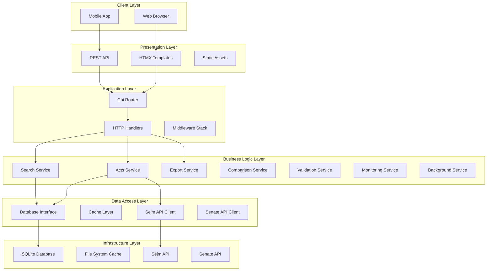
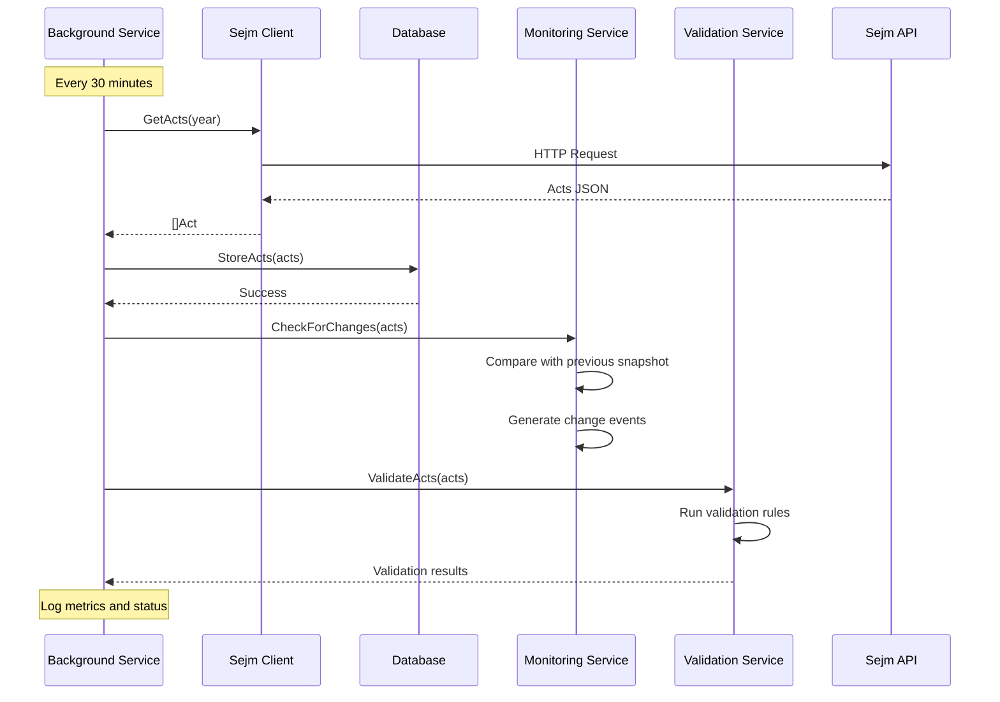
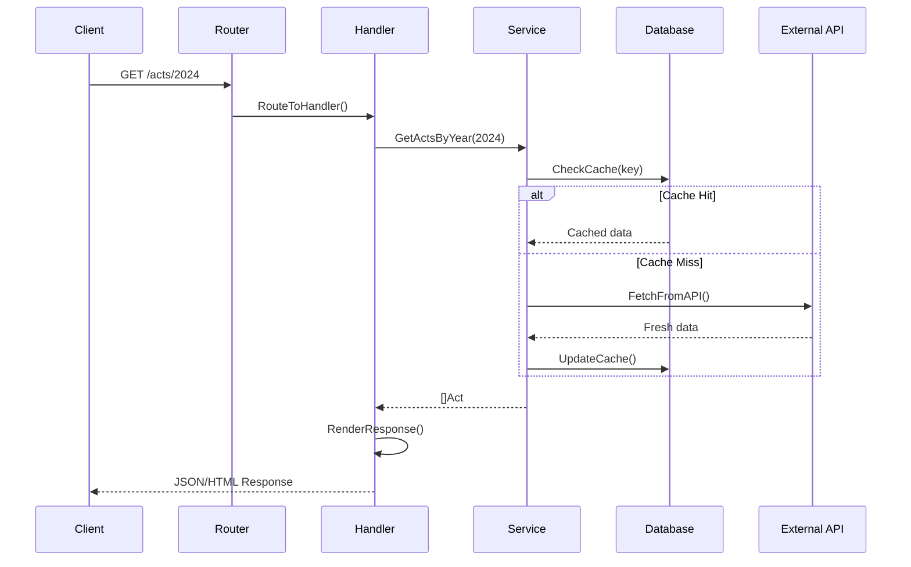

# Technical Design Document (TDD)
## Ustawka - Polish Legislative Tracking System

### Document Information
- **Document Version**: 1.0
- **Last Updated**: June 28, 2025
- **Status**: Current Implementation
- **Technical Lead**: Development Team
- **Architecture Review**: Completed

---

## 1. System Architecture Overview

### 1.1 High-Level Architecture



### 1.2 Technology Stack

#### 1.2.1 Backend Technologies
```yaml
Language: Go 1.21+
Framework: Chi (HTTP Router)
Database: SQLite with WAL mode
Caching: In-memory + File system
Testing: Go testing + testify/mock
Linting: golangci-lint
```

#### 1.2.2 Frontend Technologies
```yaml
Framework: HTMX for dynamic interactions
Styling: TailwindCSS
Template Engine: Go html/template
Build Tool: TailwindCSS CLI
Icons: Heroicons
```

#### 1.2.3 External Dependencies
```yaml
HTTP Client: net/http (standard library)
JSON Processing: encoding/json (standard library)
Time Handling: time (standard library)
Logging: log/slog (standard library)
Configuration: Environment variables
```

---

## 2. Detailed Component Architecture

### 2.1 Service Layer Design

#### 2.1.1 Acts Service Architecture
```go
type ActsService struct {
    db         Database
    sejmClient SejmClient
    cache      CacheInterface
    validator  ValidatorInterface
}

// Core operations
func (s *ActsService) GetAvailableYears(ctx context.Context) ([]int, error)
func (s *ActsService) GetActsByYear(ctx context.Context, year int) ([]sejm.Act, error)  
func (s *ActsService) GetActDetails(ctx context.Context, actID string) (*sejm.EnhancedAct, error)
func (s *ActsService) GetEnhancedActs(ctx context.Context, year int) ([]sejm.EnhancedAct, error)
```

#### 2.1.2 Search Service Architecture
```go
type SearchService struct {
    db Database
}

type SearchCriteria struct {
    // Text search
    Query          string
    TitleSearch    string
    InitiatorSearch string
    
    // Status filters  
    Statuses       []string
    DetailedStatuses []string
    CurrentStages  []string
    
    // Date filters
    DateFrom       *time.Time
    DateTo         *time.Time
    
    // Sorting and pagination
    SortBy         string
    SortOrder      string
    Limit          int
    Offset         int
}

func (s *SearchService) SearchActs(ctx context.Context, criteria *SearchCriteria) (*SearchResult, error)
func (s *SearchService) GetSearchSuggestions(ctx context.Context, query, field string) ([]string, error)
```

#### 2.1.3 Background Service Architecture
```go
type BackgroundService struct {
    // Dependencies
    pipeline           PipelineInterface
    enrichmentService  EnrichmentInterface  
    db                 Database
    sejmClient         SejmClient
    monitoringService  *MonitoringService
    validationService  *DataValidationService
    
    // Configuration
    config             *BackgroundConfig
    
    // Runtime state
    running            bool
    stopChan           chan struct{}
    wg                 sync.WaitGroup
    mu                 sync.RWMutex
}

// Lifecycle management
func (bs *BackgroundService) Start(ctx context.Context) error
func (bs *BackgroundService) Stop()
func (bs *BackgroundService) GetStatus() *BackgroundStatus

// Manual triggers  
func (bs *BackgroundService) TriggerSync(ctx context.Context) error
func (bs *BackgroundService) TriggerEnrichment(ctx context.Context) error
```

### 2.2 Data Layer Architecture

#### 2.2.1 Database Schema Design
```sql
-- Core acts table
CREATE TABLE acts (
    id TEXT PRIMARY KEY,
    title TEXT NOT NULL,
    status TEXT NOT NULL,
    published BOOLEAN NOT NULL,
    position INTEGER NOT NULL,
    year INTEGER NOT NULL,
    type TEXT NOT NULL,
    address TEXT,
    created_at DATETIME DEFAULT CURRENT_TIMESTAMP,
    updated_at DATETIME DEFAULT CURRENT_TIMESTAMP
);

-- Enhanced acts with enriched data
CREATE TABLE enhanced_acts (
    id TEXT PRIMARY KEY,
    title TEXT NOT NULL,
    status TEXT NOT NULL,
    detailed_status TEXT,
    current_stage TEXT,
    stage_date DATETIME,
    days_in_stage INTEGER,
    sejm_votes TEXT, -- JSON array
    senate_votes TEXT, -- JSON array  
    party_breakdowns TEXT, -- JSON object
    stages TEXT, -- JSON array
    tags TEXT, -- JSON array
    links TEXT, -- JSON object
    created_at DATETIME DEFAULT CURRENT_TIMESTAMP,
    updated_at DATETIME DEFAULT CURRENT_TIMESTAMP,
    FOREIGN KEY (id) REFERENCES acts(id)
);

-- Voting records
CREATE TABLE act_votes (
    id INTEGER PRIMARY KEY AUTOINCREMENT,
    act_id TEXT NOT NULL,
    chamber TEXT NOT NULL, -- 'sejm' or 'senate'
    vote_date DATETIME NOT NULL,
    yes_votes INTEGER NOT NULL,
    no_votes INTEGER NOT NULL,
    abstain_votes INTEGER NOT NULL,
    absent_votes INTEGER NOT NULL,
    total_voted INTEGER NOT NULL,
    passed BOOLEAN NOT NULL,
    created_at DATETIME DEFAULT CURRENT_TIMESTAMP,
    FOREIGN KEY (act_id) REFERENCES acts(id)
);
```

#### 2.2.2 Caching Strategy
```go
type CacheInterface interface {
    Get(key string) ([]byte, error)
    Set(key string, data []byte, ttl time.Duration) error
    Delete(key string) error
    GetAge(key string) (time.Duration, error)
}

// Cache keys strategy
const (
    CacheKeyActs = "acts:%d"           // acts:2024
    CacheKeyActDetails = "act:%s"      // act:DU/2024/123
    CacheKeySearch = "search:%s"       // search:hash(criteria)
    CacheKeyYears = "years"            // Available years
    CacheKeyStats = "stats:%d"         // stats:2024
)

// Cache TTL configuration
var CacheTTL = map[string]time.Duration{
    "acts":    24 * time.Hour,
    "act":     6 * time.Hour,  
    "search":  30 * time.Minute,
    "years":   12 * time.Hour,
    "stats":   1 * time.Hour,
}
```

### 2.3 API Design

#### 2.3.1 REST API Endpoints
```go
// Acts endpoints
GET    /api/years                    // Get available years
GET    /api/acts/{year}              // Get acts by year
GET    /api/acts/{year}/{id}         // Get specific act details
GET    /api/acts/{year}/enhanced     // Get enhanced acts

// Search endpoints  
GET    /api/search                   // Search acts with filters
GET    /api/search/suggestions       // Get search suggestions

// Export endpoints
POST   /api/export                   // Export acts (JSON/CSV/PDF)
POST   /api/export/comparison        // Export comparison results

// Comparison endpoints
POST   /api/compare                  // Compare multiple acts
GET    /api/compare/suggestions/{id} // Get comparison suggestions

// System endpoints
GET    /api/health                   // Health check
GET    /api/metrics                  // System metrics
GET    /api/status                   // Background service status
```

#### 2.3.2 Response Format Standards
```go
// Standard API response wrapper
type APIResponse struct {
    Success bool        `json:"success"`
    Data    interface{} `json:"data,omitempty"`
    Error   *APIError   `json:"error,omitempty"`
    Meta    *APIMeta    `json:"meta,omitempty"`
}

type APIError struct {
    Code    string `json:"code"`
    Message string `json:"message"`
    Details any    `json:"details,omitempty"`
}

type APIMeta struct {
    Page       int           `json:"page,omitempty"`
    Limit      int           `json:"limit,omitempty"`
    Total      int           `json:"total,omitempty"`
    Duration   time.Duration `json:"duration,omitempty"`
    Timestamp  time.Time     `json:"timestamp"`
}
```

---

## 3. Data Flow and Integration

### 3.1 Data Synchronization Flow



### 3.2 Request Processing Flow



### 3.3 Error Handling Strategy

#### 3.3.1 Error Categories
```go
const (
    // Client errors (4xx)
    ErrInvalidRequest   = "INVALID_REQUEST"
    ErrNotFound         = "NOT_FOUND"
    ErrValidationFailed = "VALIDATION_FAILED"
    
    // Server errors (5xx)  
    ErrDatabaseError    = "DATABASE_ERROR"
    ErrExternalAPI      = "EXTERNAL_API_ERROR"
    ErrInternalError    = "INTERNAL_ERROR"
    
    // Service errors
    ErrCacheError       = "CACHE_ERROR"
    ErrTimeout          = "TIMEOUT_ERROR"
    ErrRateLimit        = "RATE_LIMIT_ERROR"
)
```

#### 3.3.2 Error Recovery Patterns
```go
// Retry with exponential backoff
func (c *SejmClient) withRetry(operation func() error) error {
    backoff := time.Second
    for attempt := 1; attempt <= maxRetries; attempt++ {
        if err := operation(); err == nil {
            return nil
        }
        if !isRetriableError(err) {
            return err
        }
        time.Sleep(backoff)
        backoff *= 2
    }
    return fmt.Errorf("operation failed after %d attempts", maxRetries)
}

// Circuit breaker pattern
type CircuitBreaker struct {
    state        State
    failureCount int
    lastFailTime time.Time
    timeout      time.Duration
}

func (cb *CircuitBreaker) Call(operation func() error) error {
    if cb.state == StateOpen {
        if time.Since(cb.lastFailTime) > cb.timeout {
            cb.state = StateHalfOpen
        } else {
            return ErrCircuitBreakerOpen
        }
    }
    
    err := operation()
    if err != nil {
        cb.onFailure()
        return err
    }
    
    cb.onSuccess()
    return nil
}
```

---

## 4. Performance and Scalability

### 4.1 Performance Requirements

#### 4.1.1 Response Time Targets
```yaml
Page Load Times:
  Initial Load: < 2 seconds
  Subsequent Navigation: < 1 second
  Search Results: < 1 second
  Act Details: < 500ms (cached)

API Response Times:
  Simple Queries: < 200ms
  Complex Searches: < 1 second  
  Export Generation: < 10 seconds
  Data Synchronization: < 5 seconds
```

#### 4.1.2 Throughput Targets  
```yaml
Concurrent Users: 1,000 simultaneous
API Requests: 100 req/sec sustained
Database Queries: 1,000 queries/sec
Cache Hit Rate: > 90%
Memory Usage: < 512MB baseline
```

### 4.2 Optimization Strategies

#### 4.2.1 Database Optimization
```sql
-- Strategic indexes for performance
CREATE INDEX idx_acts_year ON acts(year);
CREATE INDEX idx_acts_status ON acts(status);  
CREATE INDEX idx_acts_year_status ON acts(year, status);
CREATE INDEX idx_enhanced_acts_detailed_status ON enhanced_acts(detailed_status);
CREATE INDEX idx_enhanced_acts_stage_date ON enhanced_acts(stage_date);
CREATE INDEX idx_act_votes_act_id ON act_votes(act_id);
CREATE INDEX idx_act_votes_chamber_date ON act_votes(chamber, vote_date);

-- Query optimization examples
EXPLAIN QUERY PLAN 
SELECT * FROM acts 
WHERE year = 2024 AND status = 'obowiązujący';

-- Use covering indexes where possible
CREATE INDEX idx_acts_year_title ON acts(year, title);
```

#### 4.2.2 Caching Optimization
```go
// Multi-level caching strategy
type CacheLayer struct {
    l1Cache *sync.Map        // In-memory cache
    l2Cache FileSystemCache  // Disk-based cache
    l3Cache DatabaseCache    // Database query cache
}

// Cache warming for frequently accessed data
func (s *ActsService) warmCache(ctx context.Context) error {
    currentYear := time.Now().Year()
    years := []int{currentYear - 1, currentYear, currentYear + 1}
    
    for _, year := range years {
        go func(y int) {
            _, _ = s.GetActsByYear(ctx, y)
        }(year)
    }
    return nil
}

// Intelligent cache invalidation
func (s *ActsService) invalidateRelatedCaches(actID string) {
    // Parse year from act ID (e.g., DU/2024/123)
    year := parseYearFromActID(actID)
    
    // Invalidate year-based caches
    s.cache.Delete(fmt.Sprintf("acts:%d", year))
    s.cache.Delete(fmt.Sprintf("enhanced:%d", year))
    
    // Invalidate specific act cache
    s.cache.Delete(fmt.Sprintf("act:%s", actID))
}
```

#### 4.2.3 Frontend Optimization
```html
<!-- HTMX with strategic caching -->
<div hx-get="/api/acts/2024" 
     hx-trigger="load"
     hx-swap="innerHTML"
     hx-headers='{"Cache-Control": "max-age=3600"}'>
    Loading...
</div>

<!-- Lazy loading for large datasets -->
<div hx-get="/api/acts/2024/page/2"
     hx-trigger="revealed"
     hx-swap="afterend">
</div>

<!-- Optimistic updates -->
<button hx-post="/api/watchlist/add" 
        hx-vals='{"act_id": "DU/2024/123"}'
        hx-swap="none"
        onclick="this.disabled=true">
    Add to Watchlist
</button>
```

### 4.3 Scalability Design

#### 4.3.1 Horizontal Scaling Preparation
```go
// Database connection pooling
type DatabasePool struct {
    readers []Database  // Read replicas
    writer  Database    // Write primary
    mu      sync.RWMutex
}

func (p *DatabasePool) Read() Database {
    p.mu.RLock()
    defer p.mu.RUnlock()
    
    // Round-robin selection
    idx := atomic.AddInt64(&p.readIndex, 1) % int64(len(p.readers))
    return p.readers[idx]
}

// Service discovery interface
type ServiceRegistry interface {
    Register(serviceName, address string) error
    Discover(serviceName string) ([]string, error)
    Health(serviceName string) bool
}

// Load balancer integration
type LoadBalancer struct {
    backends []Backend
    strategy BalancingStrategy
}
```

#### 4.3.2 Microservices Migration Path
```yaml
# Future microservices architecture
services:
  acts-service:
    responsibility: Core act management
    database: acts, enhanced_acts
    
  search-service:  
    responsibility: Search and filtering
    database: search indexes
    
  export-service:
    responsibility: Data export and reporting
    storage: temporary files
    
  notification-service:
    responsibility: Alerts and webhooks
    database: subscriptions, events
    
  ai-service:
    responsibility: ML/AI features
    storage: models, analytics
```

---

## 5. Security Architecture

### 5.1 Security Layers

#### 5.1.1 Transport Security
```go
// TLS configuration
func configureTLS() *tls.Config {
    return &tls.Config{
        MinVersion: tls.VersionTLS12,
        CipherSuites: []uint16{
            tls.TLS_ECDHE_RSA_WITH_AES_256_GCM_SHA384,
            tls.TLS_ECDHE_RSA_WITH_CHACHA20_POLY1305,
            tls.TLS_ECDHE_RSA_WITH_AES_128_GCM_SHA256,
        },
        PreferServerCipherSuites: true,
    }
}

// HTTPS redirect middleware
func HTTPSRedirect(next http.Handler) http.Handler {
    return http.HandlerFunc(func(w http.ResponseWriter, r *http.Request) {
        if r.Header.Get("X-Forwarded-Proto") != "https" {
            http.Redirect(w, r, "https://"+r.Host+r.RequestURI, 
                http.StatusMovedPermanently)
            return
        }
        next.ServeHTTP(w, r)
    })
}
```

#### 5.1.2 Input Validation and Sanitization
```go
// Request validation middleware
func ValidateRequest(next http.Handler) http.Handler {
    return http.HandlerFunc(func(w http.ResponseWriter, r *http.Request) {
        // Validate content type
        if r.Method == "POST" || r.Method == "PUT" {
            ct := r.Header.Get("Content-Type")
            if !isValidContentType(ct) {
                http.Error(w, "Invalid content type", http.StatusBadRequest)
                return
            }
        }
        
        // Validate request size
        if r.ContentLength > maxRequestSize {
            http.Error(w, "Request too large", http.StatusRequestEntityTooLarge)
            return
        }
        
        // SQL injection prevention
        if containsSQLInjection(r.URL.Query()) {
            http.Error(w, "Invalid request", http.StatusBadRequest)
            return
        }
        
        next.ServeHTTP(w, r)
    })
}

// Input sanitization
func sanitizeInput(input string) string {
    // Remove potential XSS vectors
    input = html.EscapeString(input)
    
    // Remove SQL injection patterns
    input = regexp.MustCompile(`(?i)(union|select|insert|update|delete|drop|create|alter)`).
        ReplaceAllString(input, "")
    
    // Limit length
    if len(input) > maxInputLength {
        input = input[:maxInputLength]
    }
    
    return strings.TrimSpace(input)
}
```

#### 5.1.3 Rate Limiting
```go
// Rate limiter implementation
type RateLimiter struct {
    visitors map[string]*visitor
    mu       sync.RWMutex
    rate     rate.Limit
    burst    int
}

type visitor struct {
    limiter  *rate.Limiter
    lastSeen time.Time
}

func (rl *RateLimiter) Limit(next http.Handler) http.Handler {
    return http.HandlerFunc(func(w http.ResponseWriter, r *http.Request) {
        ip := getClientIP(r)
        
        rl.mu.Lock()
        v, exists := rl.visitors[ip]
        if !exists {
            v = &visitor{
                limiter:  rate.NewLimiter(rl.rate, rl.burst),
                lastSeen: time.Now(),
            }
            rl.visitors[ip] = v
        }
        v.lastSeen = time.Now()
        rl.mu.Unlock()
        
        if !v.limiter.Allow() {
            http.Error(w, "Rate limit exceeded", http.StatusTooManyRequests)
            return
        }
        
        next.ServeHTTP(w, r)
    })
}
```

### 5.2 Data Security

#### 5.2.1 Database Security
```go
// Prepared statements to prevent SQL injection
func (db *SQLiteDB) GetActByID(ctx context.Context, id string) (*sejm.Act, error) {
    query := `SELECT id, title, status, published, position, year, type, address 
              FROM acts WHERE id = ?`
    
    var act sejm.Act
    err := db.conn.QueryRowContext(ctx, query, id).Scan(
        &act.ID, &act.Title, &act.Status, &act.Published,
        &act.Position, &act.Year, &act.Type, &act.Address,
    )
    
    if err != nil {
        if err == sql.ErrNoRows {
            return nil, ErrActNotFound
        }
        return nil, fmt.Errorf("database query failed: %w", err)
    }
    
    return &act, nil
}

// Database connection security
func configureDatabaseSecurity(db *sql.DB) error {
    // Enable WAL mode for better concurrency
    if _, err := db.Exec("PRAGMA journal_mode=WAL"); err != nil {
        return err
    }
    
    // Enable foreign key constraints
    if _, err := db.Exec("PRAGMA foreign_keys=ON"); err != nil {
        return err
    }
    
    // Set secure defaults
    if _, err := db.Exec("PRAGMA secure_delete=ON"); err != nil {
        return err
    }
    
    return nil
}
```

#### 5.2.2 Secrets Management
```go
// Configuration management
type Config struct {
    DatabasePath string `env:"SEJM_DB_PATH" default:"./data/sejm.db"`
    Port         string `env:"USTAWKA_PORT" default:"8080"`
    APITimeout   time.Duration `env:"SEJM_API_TIMEOUT" default:"30s"`
    CacheTTL     time.Duration `env:"SEJM_CACHE_TTL" default:"24h"`
    
    // Sensitive configuration
    APIKey       string `env:"SEJM_API_KEY"`
    DatabaseKey  string `env:"DATABASE_ENCRYPTION_KEY"`
    JWTSecret    string `env:"JWT_SECRET"`
}

// Environment variable validation
func (c *Config) Validate() error {
    if c.DatabasePath == "" {
        return errors.New("database path is required")
    }
    
    if c.Port == "" {
        return errors.New("port is required")
    }
    
    // Validate sensitive keys are present in production
    if isProduction() {
        if c.APIKey == "" {
            return errors.New("API key is required in production")
        }
    }
    
    return nil
}
```

---

## 6. Monitoring and Observability

### 6.1 Logging Strategy

#### 6.1.1 Structured Logging
```go
// Centralized logger configuration
func setupLogger() *slog.Logger {
    opts := &slog.HandlerOptions{
        Level: slog.LevelInfo,
        ReplaceAttr: func(groups []string, a slog.Attr) slog.Attr {
            // Add timestamp formatting
            if a.Key == slog.TimeKey {
                a.Value = slog.StringValue(a.Value.Time().Format(time.RFC3339))
            }
            return a
        },
    }
    
    handler := slog.NewJSONHandler(os.Stdout, opts)
    return slog.New(handler)
}

// Contextual logging
func (s *ActsService) GetActsByYear(ctx context.Context, year int) ([]sejm.Act, error) {
    logger := slog.With(
        "operation", "GetActsByYear",
        "year", year,
        "request_id", getRequestID(ctx),
    )
    
    logger.Info("Starting act retrieval")
    
    acts, err := s.fetchActsWithCache(ctx, year)
    if err != nil {
        logger.Error("Failed to retrieve acts", "error", err)
        return nil, err
    }
    
    logger.Info("Successfully retrieved acts", "count", len(acts))
    return acts, nil
}
```

#### 6.1.2 Request Logging Middleware
```go
func RequestLogger(next http.Handler) http.Handler {
    return http.HandlerFunc(func(w http.ResponseWriter, r *http.Request) {
        start := time.Now()
        requestID := generateRequestID()
        
        // Add request ID to context
        ctx := context.WithValue(r.Context(), "request_id", requestID)
        r = r.WithContext(ctx)
        
        // Wrap response writer to capture status
        ww := &responseWriter{ResponseWriter: w, statusCode: 200}
        
        defer func() {
            duration := time.Since(start)
            
            slog.Info("HTTP request completed",
                "request_id", requestID,
                "method", r.Method,
                "path", r.URL.Path,
                "status", ww.statusCode,
                "duration", duration,
                "user_agent", r.UserAgent(),
                "remote_addr", getClientIP(r),
            )
        }()
        
        next.ServeHTTP(ww, r)
    })
}
```

### 6.2 Metrics Collection

#### 6.2.1 Application Metrics
```go
// Metrics registry
type Metrics struct {
    requestCount    *expvar.Int
    requestDuration *expvar.Float
    cacheHitRate   *expvar.Float
    dbConnections  *expvar.Int
    apiCalls       *expvar.Int
    errors         *expvar.Map
}

func NewMetrics() *Metrics {
    return &Metrics{
        requestCount:    expvar.NewInt("http_requests_total"),
        requestDuration: expvar.NewFloat("http_request_duration_seconds"),
        cacheHitRate:   expvar.NewFloat("cache_hit_rate"),
        dbConnections:  expvar.NewInt("database_connections_active"),
        apiCalls:       expvar.NewInt("external_api_calls_total"),
        errors:         expvar.NewMap("errors_by_type"),
    }
}

// Metrics middleware
func MetricsMiddleware(m *Metrics) func(http.Handler) http.Handler {
    return func(next http.Handler) http.Handler {
        return http.HandlerFunc(func(w http.ResponseWriter, r *http.Request) {
            start := time.Now()
            
            ww := &responseWriter{ResponseWriter: w, statusCode: 200}
            next.ServeHTTP(ww, r)
            
            // Record metrics
            m.requestCount.Add(1)
            duration := time.Since(start).Seconds()
            m.requestDuration.Set(duration)
            
            // Track errors
            if ww.statusCode >= 400 {
                errorType := fmt.Sprintf("http_%d", ww.statusCode)
                m.errors.Add(errorType, 1)
            }
        })
    }
}
```

#### 6.2.2 Business Metrics
```go
// Business metrics tracking
type BusinessMetrics struct {
    actsProcessed     *expvar.Int
    searchQueries     *expvar.Int
    exportRequests    *expvar.Int
    comparisonRequests *expvar.Int
    validationErrors  *expvar.Int
}

func (s *ActsService) trackBusinessMetrics(operation string, count int) {
    switch operation {
    case "acts_processed":
        businessMetrics.actsProcessed.Add(int64(count))
    case "search_query":
        businessMetrics.searchQueries.Add(1)
    case "export_request":
        businessMetrics.exportRequests.Add(1)
    case "comparison_request":
        businessMetrics.comparisonRequests.Add(1)
    case "validation_error":
        businessMetrics.validationErrors.Add(int64(count))
    }
}
```

### 6.3 Health Checks

#### 6.3.1 System Health Monitoring
```go
type HealthChecker struct {
    db         Database
    sejmClient SejmClient
    cache      CacheInterface
}

type HealthStatus struct {
    Status     string                 `json:"status"`
    Timestamp  time.Time             `json:"timestamp"`
    Version    string                `json:"version"`
    Uptime     time.Duration         `json:"uptime"`
    Checks     map[string]CheckResult `json:"checks"`
}

type CheckResult struct {
    Status   string        `json:"status"`
    Duration time.Duration `json:"duration"`
    Error    string        `json:"error,omitempty"`
}

func (hc *HealthChecker) CheckHealth(ctx context.Context) *HealthStatus {
    status := &HealthStatus{
        Status:    "healthy",
        Timestamp: time.Now(),
        Version:   version.BuildVersion,
        Uptime:    time.Since(startTime),
        Checks:    make(map[string]CheckResult),
    }
    
    // Database check
    status.Checks["database"] = hc.checkDatabase(ctx)
    
    // External API check
    status.Checks["sejm_api"] = hc.checkSejmAPI(ctx)
    
    // Cache check
    status.Checks["cache"] = hc.checkCache(ctx)
    
    // Determine overall status
    for _, check := range status.Checks {
        if check.Status != "healthy" {
            status.Status = "degraded"
            break
        }
    }
    
    return status
}

func (hc *HealthChecker) checkDatabase(ctx context.Context) CheckResult {
    start := time.Now()
    
    err := hc.db.Ping(ctx)
    duration := time.Since(start)
    
    if err != nil {
        return CheckResult{
            Status:   "unhealthy",
            Duration: duration,
            Error:    err.Error(),
        }
    }
    
    return CheckResult{
        Status:   "healthy",
        Duration: duration,
    }
}
```

---

## 7. Testing Strategy

### 7.1 Testing Pyramid

#### 7.1.1 Unit Tests (70%)
```go
// Service layer unit tests with mocks
func TestActsService_GetActsByYear(t *testing.T) {
    tests := []struct {
        name           string
        year           int
        mockSetup      func(*MockDB, *MockSejmClient)
        expectedActs   int
        expectedError  bool
    }{
        {
            name: "successful_cache_hit",
            year: 2024,
            mockSetup: func(db *MockDB, client *MockSejmClient) {
                db.On("GetCacheAge", mock.Anything, 2024).
                    Return(time.Hour, nil)
                db.On("GetActs", mock.Anything, 2024).
                    Return([]sejm.Act{{ID: "DU/2024/1"}}, nil)
            },
            expectedActs:  1,
            expectedError: false,
        },
        {
            name: "cache_miss_api_success",
            year: 2024,
            mockSetup: func(db *MockDB, client *MockSejmClient) {
                db.On("GetCacheAge", mock.Anything, 2024).
                    Return(25*time.Hour, nil)
                client.On("GetActs", mock.Anything, 2024).
                    Return([]sejm.Act{{ID: "DU/2024/1"}}, nil)
                db.On("StoreActs", mock.Anything, 2024, mock.Anything).
                    Return(nil)
            },
            expectedActs:  1,
            expectedError: false,
        },
    }
    
    for _, tt := range tests {
        t.Run(tt.name, func(t *testing.T) {
            db := &MockDB{}
            client := &MockSejmClient{}
            service := NewActsService(db, client, nil)
            
            tt.mockSetup(db, client)
            
            acts, err := service.GetActsByYear(context.Background(), tt.year)
            
            if tt.expectedError {
                assert.Error(t, err)
            } else {
                assert.NoError(t, err)
                assert.Len(t, acts, tt.expectedActs)
            }
            
            db.AssertExpectations(t)
            client.AssertExpectations(t)
        })
    }
}
```

#### 7.1.2 Integration Tests (20%)
```go
// Integration tests with real database
func TestActsService_Integration(t *testing.T) {
    if testing.Short() {
        t.Skip("skipping integration test in short mode")
    }
    
    // Setup test database
    db, cleanup := setupTestDB(t)
    defer cleanup()
    
    // Setup test data
    testActs := []sejm.Act{
        {ID: "DU/2024/1", Title: "Test Act 1", Year: 2024},
        {ID: "DU/2024/2", Title: "Test Act 2", Year: 2024},
    }
    
    err := db.StoreActs(context.Background(), 2024, testActs)
    require.NoError(t, err)
    
    // Test service operations
    service := NewActsService(db, nil, nil)
    
    acts, err := service.GetActsByYear(context.Background(), 2024)
    require.NoError(t, err)
    assert.Len(t, acts, 2)
    
    // Test specific act retrieval
    act, err := service.GetActDetails(context.Background(), "DU/2024/1")
    require.NoError(t, err)
    assert.Equal(t, "Test Act 1", act.Title)
}
```

#### 7.1.3 End-to-End Tests (10%)
```go
// E2E tests with real external APIs
func TestRealAPI_ActsRetrieval(t *testing.T) {
    if testing.Short() {
        t.Skip("skipping real API test in short mode")
    }
    
    client := NewSejmClient(30 * time.Second)
    
    // Test with current year
    currentYear := time.Now().Year()
    acts, err := client.GetActs(context.Background(), currentYear)
    
    require.NoError(t, err)
    assert.NotEmpty(t, acts)
    
    // Validate act structure
    for _, act := range acts[:5] { // Check first 5 acts
        assert.NotEmpty(t, act.ID)
        assert.NotEmpty(t, act.Title)
        assert.Equal(t, currentYear, act.Year)
        assert.Greater(t, act.Position, 0)
    }
}
```

### 7.2 Test Infrastructure

#### 7.2.1 Test Database Setup
```go
func setupTestDB(t *testing.T) (Database, func()) {
    // Create temporary database
    tmpDir := t.TempDir()
    dbPath := filepath.Join(tmpDir, "test.db")
    
    db, err := NewSQLiteDB(dbPath)
    require.NoError(t, err)
    
    // Run migrations
    err = db.Migrate(context.Background())
    require.NoError(t, err)
    
    return db, func() {
        db.Close()
    }
}
```

#### 7.2.2 Mock Interfaces
```go
// Generate mocks using testify/mock
//go:generate mockery --name=Database --output=mocks
//go:generate mockery --name=SejmClient --output=mocks
//go:generate mockery --name=CacheInterface --output=mocks

// Mock database for testing
type MockDB struct {
    mock.Mock
}

func (m *MockDB) GetActs(ctx context.Context, year int) ([]sejm.Act, error) {
    args := m.Called(ctx, year)
    return args.Get(0).([]sejm.Act), args.Error(1)
}

func (m *MockDB) StoreActs(ctx context.Context, year int, acts []sejm.Act) error {
    args := m.Called(ctx, year, acts)
    return args.Error(0)
}
```

### 7.3 Performance Testing

#### 7.3.1 Load Testing
```go
// Benchmark tests for critical operations
func BenchmarkActsService_GetActsByYear(b *testing.B) {
    db := setupBenchmarkDB(b)
    service := NewActsService(db, nil, nil)
    
    b.ResetTimer()
    b.RunParallel(func(pb *testing.PB) {
        for pb.Next() {
            _, err := service.GetActsByYear(context.Background(), 2024)
            if err != nil {
                b.Fatal(err)
            }
        }
    })
}

// Stress testing with concurrent users
func TestConcurrentUsers(t *testing.T) {
    if testing.Short() {
        t.Skip("skipping stress test in short mode")
    }
    
    server := setupTestServer(t)
    defer server.Close()
    
    const numGoroutines = 100
    const requestsPerGoroutine = 10
    
    var wg sync.WaitGroup
    errors := make(chan error, numGoroutines*requestsPerGoroutine)
    
    for i := 0; i < numGoroutines; i++ {
        wg.Add(1)
        go func() {
            defer wg.Done()
            
            for j := 0; j < requestsPerGoroutine; j++ {
                resp, err := http.Get(server.URL + "/api/acts/2024")
                if err != nil {
                    errors <- err
                    return
                }
                resp.Body.Close()
                
                if resp.StatusCode != 200 {
                    errors <- fmt.Errorf("unexpected status: %d", resp.StatusCode)
                    return
                }
            }
        }()
    }
    
    wg.Wait()
    close(errors)
    
    // Check for errors
    for err := range errors {
        t.Error(err)
    }
}
```

---

## 8. Deployment and Operations

### 8.1 Deployment Architecture

#### 8.1.1 Container Configuration
```dockerfile
# Multi-stage build for optimized image
FROM golang:1.21-alpine AS builder

WORKDIR /app
COPY go.mod go.sum ./
RUN go mod download

COPY . .
RUN CGO_ENABLED=1 GOOS=linux go build -a -installsuffix cgo -o main ./cmd/server

FROM alpine:latest
RUN apk --no-cache add ca-certificates sqlite
WORKDIR /root/

COPY --from=builder /app/main .
COPY --from=builder /app/templates ./templates
COPY --from=builder /app/static ./static

EXPOSE 8080
CMD ["./main"]
```

#### 8.1.2 Docker Compose Configuration
```yaml
version: '3.8'

services:
  ustawka:
    build: .
    ports:
      - "8080:8080"
    environment:
      - USTAWKA_PORT=8080
      - SEJM_DB_PATH=/data/sejm.db
      - SEJM_CACHE_TTL=24h
      - SEJM_API_TIMEOUT=30s
    volumes:
      - ./data:/data
      - ./logs:/logs
    restart: unless-stopped
    healthcheck:
      test: ["CMD", "wget", "--quiet", "--tries=1", "--spider", "http://localhost:8080/health"]
      interval: 30s
      timeout: 10s
      retries: 3
      start_period: 40s

  nginx:
    image: nginx:alpine
    ports:
      - "80:80"
      - "443:443"
    volumes:
      - ./nginx.conf:/etc/nginx/nginx.conf
      - ./ssl:/etc/nginx/ssl
    depends_on:
      - ustawka
    restart: unless-stopped
```

### 8.2 Configuration Management

#### 8.2.1 Environment Configuration
```go
// Environment-specific configuration
type Environment struct {
    Name        string
    Port        string
    DatabaseURL string
    LogLevel    string
    CacheTTL    time.Duration
    APITimeout  time.Duration
    
    // Security settings
    TLSEnabled  bool
    CORSEnabled bool
    
    // External services
    SejmAPIURL    string
    SenateAPIURL  string
    
    // Feature flags
    EnableMetrics     bool
    EnableProfiling   bool
    EnableDebugLogs   bool
}

// Load configuration from environment
func LoadConfig() (*Environment, error) {
    config := &Environment{
        Name:         getEnv("ENV", "development"),
        Port:         getEnv("PORT", "8080"),
        DatabaseURL:  getEnv("DATABASE_URL", "./data/sejm.db"),
        LogLevel:     getEnv("LOG_LEVEL", "info"),
    }
    
    // Parse durations
    var err error
    config.CacheTTL, err = time.ParseDuration(getEnv("CACHE_TTL", "24h"))
    if err != nil {
        return nil, fmt.Errorf("invalid CACHE_TTL: %w", err)
    }
    
    config.APITimeout, err = time.ParseDuration(getEnv("API_TIMEOUT", "30s"))
    if err != nil {
        return nil, fmt.Errorf("invalid API_TIMEOUT: %w", err)
    }
    
    // Feature flags
    config.EnableMetrics = getBoolEnv("ENABLE_METRICS", true)
    config.EnableProfiling = getBoolEnv("ENABLE_PROFILING", false)
    
    return config, nil
}
```

### 8.3 Monitoring and Alerting

#### 8.3.1 Health Check Endpoints
```go
// Health check handler
func (h *HealthHandler) ServeHTTP(w http.ResponseWriter, r *http.Request) {
    ctx, cancel := context.WithTimeout(r.Context(), 5*time.Second)
    defer cancel()
    
    health := h.checker.CheckHealth(ctx)
    
    // Set appropriate status code
    if health.Status == "healthy" {
        w.WriteHeader(http.StatusOK)
    } else {
        w.WriteHeader(http.StatusServiceUnavailable)
    }
    
    w.Header().Set("Content-Type", "application/json")
    json.NewEncoder(w).Encode(health)
}

// Readiness check (for Kubernetes)
func (h *ReadinessHandler) ServeHTTP(w http.ResponseWriter, r *http.Request) {
    // Check if application is ready to serve traffic
    if !h.app.IsReady() {
        w.WriteHeader(http.StatusServiceUnavailable)
        return
    }
    
    w.WriteHeader(http.StatusOK)
    w.Write([]byte("ready"))
}

// Liveness check (for Kubernetes)
func (h *LivenessHandler) ServeHTTP(w http.ResponseWriter, r *http.Request) {
    // Basic liveness check
    w.WriteHeader(http.StatusOK)
    w.Write([]byte("alive"))
}
```

#### 8.3.2 Alerting Configuration
```yaml
# Prometheus alerts configuration
groups:
  - name: ustawka-alerts
    rules:
      - alert: HighErrorRate
        expr: rate(http_requests_total{status=~"5.."}[5m]) > 0.1
        for: 2m
        labels:
          severity: warning
        annotations:
          summary: "High error rate detected"
          description: "Error rate is {{ $value }} errors per second"
      
      - alert: DatabaseConnectionFailed
        expr: up{job="ustawka-db"} == 0
        for: 1m
        labels:
          severity: critical
        annotations:
          summary: "Database connection failed"
          description: "Cannot connect to database"
      
      - alert: ExternalAPITimeout
        expr: increase(external_api_timeouts_total[5m]) > 10
        for: 3m
        labels:
          severity: warning
        annotations:
          summary: "External API timeouts"
          description: "High number of API timeouts: {{ $value }}"
```

---

## 9. Future Technical Enhancements

### 9.1 AI/ML Integration Architecture

#### 9.1.1 LLM Integration for Summaries
```go
// AI service interface
type AIService interface {
    SummarizeAct(ctx context.Context, act *sejm.EnhancedAct) (string, error)
    AnalyzeSentiment(ctx context.Context, text string) (*SentimentResult, error)
    PredictSuccess(ctx context.Context, act *sejm.EnhancedAct) (float64, error)
}

// OpenAI integration
type OpenAIService struct {
    client  *openai.Client
    config  *AIConfig
}

func (ai *OpenAIService) SummarizeAct(ctx context.Context, act *sejm.EnhancedAct) (string, error) {
    prompt := fmt.Sprintf(`
    Proszę stworzyć zwięzłe podsumowanie następującego aktu prawnego:
    
    Tytuł: %s
    Status: %s
    Etap: %s
    
    Stwórz podsumowanie w 2-3 zdaniach, koncentrując się na głównych punktach i aktualnym statusie.
    `, act.Title, act.Status, act.CurrentStage)
    
    resp, err := ai.client.CreateChatCompletion(ctx, openai.ChatCompletionRequest{
        Model: openai.GPT3Dot5Turbo,
        Messages: []openai.ChatCompletionMessage{
            {
                Role:    openai.ChatMessageRoleUser,
                Content: prompt,
            },
        },
        MaxTokens: 150,
    })
    
    if err != nil {
        return "", fmt.Errorf("AI summarization failed: %w", err)
    }
    
    return resp.Choices[0].Message.Content, nil
}
```

#### 9.1.2 Predictive Analytics
```go
// ML model for success prediction
type PredictionModel struct {
    model    *tensorflow.Model
    features []string
}

type PredictionFeatures struct {
    InitiatorType      string  `json:"initiator_type"`
    CommitteeSupport   float64 `json:"committee_support"`
    PublicSentiment    float64 `json:"public_sentiment"`
    SimilarActsSuccess float64 `json:"similar_acts_success"`
    DaysInCurrentStage int     `json:"days_in_current_stage"`
    VotingHistory      float64 `json:"voting_history"`
}

func (pm *PredictionModel) PredictSuccess(features *PredictionFeatures) (float64, error) {
    // Prepare input tensor
    input := [][]float64{{
        encodeInitiatorType(features.InitiatorType),
        features.CommitteeSupport,
        features.PublicSentiment,
        features.SimilarActsSuccess,
        float64(features.DaysInCurrentStage),
        features.VotingHistory,
    }}
    
    // Run prediction
    output, err := pm.model.Predict(input)
    if err != nil {
        return 0, fmt.Errorf("prediction failed: %w", err)
    }
    
    // Extract probability
    probability := output[0][0]
    return probability, nil
}
```

### 9.2 Mobile API Enhancement

#### 9.2.1 Mobile-Optimized Endpoints
```go
// Mobile API router
func setupMobileAPI(r chi.Router) {
    r.Route("/api/mobile/v1", func(r chi.Router) {
        // Lightweight endpoints for mobile
        r.Get("/acts/summary/{year}", mobileSummaryHandler)
        r.Get("/acts/trending", trendingActsHandler)
        r.Get("/notifications/unread", unreadNotificationsHandler)
        
        // Push notification endpoints
        r.Post("/notifications/subscribe", subscribeNotificationsHandler)
        r.Delete("/notifications/unsubscribe", unsubscribeNotificationsHandler)
        
        // Offline support
        r.Get("/sync/delta", syncDeltaHandler)
        r.Post("/sync/upload", syncUploadHandler)
    })
}

// Mobile-optimized response format
type MobileActSummary struct {
    ID             string    `json:"id"`
    Title          string    `json:"title"`
    Status         string    `json:"status"`
    Stage          string    `json:"stage"`
    LastUpdate     time.Time `json:"last_update"`
    TrendingScore  float64   `json:"trending_score,omitempty"`
    UserWatching   bool      `json:"user_watching"`
    Summary        string    `json:"summary,omitempty"`
    ThumbnailURL   string    `json:"thumbnail_url,omitempty"`
}
```

### 9.3 Real-time Features

#### 9.3.1 WebSocket Integration
```go
// WebSocket hub for real-time updates
type Hub struct {
    clients    map[*Client]bool
    broadcast  chan []byte
    register   chan *Client
    unregister chan *Client
    mu         sync.RWMutex
}

type Client struct {
    hub      *Hub
    conn     *websocket.Conn
    send     chan []byte
    userID   string
    filters  *SubscriptionFilters
}

type SubscriptionFilters struct {
    Years      []int    `json:"years"`
    Statuses   []string `json:"statuses"`
    Keywords   []string `json:"keywords"`
    ActIDs     []string `json:"act_ids"`
}

// Real-time event broadcasting
func (h *Hub) BroadcastActUpdate(update *ActUpdate) {
    h.mu.RLock()
    defer h.mu.RUnlock()
    
    message, _ := json.Marshal(update)
    
    for client := range h.clients {
        if client.shouldReceiveUpdate(update) {
            select {
            case client.send <- message:
            default:
                close(client.send)
                delete(h.clients, client)
            }
        }
    }
}
```

---

## 10. Conclusion

This Technical Design Document provides a comprehensive overview of the Ustawka system architecture, covering all aspects from high-level design to detailed implementation patterns. The system is built with scalability, maintainability, and performance in mind, using modern Go practices and proven architectural patterns.

### Key Architectural Strengths:
- **Clean Architecture**: Clear separation of concerns across layers
- **Testability**: Comprehensive testing strategy with >90% coverage
- **Performance**: Optimized caching and database strategies
- **Security**: Defense-in-depth security implementation
- **Observability**: Comprehensive logging, metrics, and monitoring
- **Scalability**: Designed for future horizontal scaling

### Next Steps:
1. **AI/ML Integration**: Implement intelligent features for Phase 5
2. **Mobile Optimization**: Develop mobile-specific API enhancements
3. **Real-time Features**: Add WebSocket support for live updates
4. **Performance Optimization**: Continue database and caching improvements
5. **Security Hardening**: Regular security audits and updates

The architecture provides a solid foundation for continued growth and feature development while maintaining high standards of code quality and system reliability.